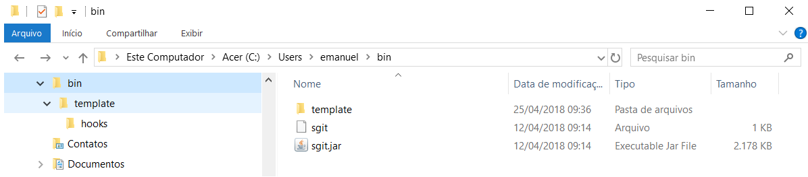

# sgit-installer

Installer for sgit (https://github.com/emanuelcruzrodrigues/sgit). 

After installation, all sgit commands will be disponible typing "sgit &lt;git command>"

## Instalação manual no Linux

1. Crie uma pasta chamada .sgit no diretório home do seu usuário
1. Abra o sgit-installer.jar (anexo nesta página) em algum descompactador de arquivos
1. Extraia a pasta hooks no diretório .sgit
1. Extraia os arquivos sgit e sgit.jar e coloque-os na pasta /bin
1. Em um terminal, execute:

> git config ~-~-global init.templatedir '<diretório home do seu usuário>/.sgit'
> 
> chmod +x <diretório home do seu usuário>/.sgit/hooks/commit-msg
> 
> sudo chmod +x /bin/sgit

## Instalação manual no Windows

1. Execute o Git Bash (botão direito do mouse em qualquer pasta, Git Bash here ...)
1. Execute o comando $PATH para ver quais os diretórios estão mapeados no path do Git e eleja algum destes diretórios para conter os arquivos do sgit. 

A partir deste ponto do tutorial, vou me referir a esta pasta como "diretório do sgit". Observação: Talvez o diretório não exista no seu computador, neste caso, basta criá-lo.

3. No diretório do sgit, crie uma pasta chamada template.
4. Abra o sgit-installer.jar (anexo nesta página) em algum descompactador de arquivos
5. Extraia o diretório hooks dentro da pasta template criada no diretório do sgit
6. Extraia o arquivos sgit e sgit.jar na raiz do diretório do sgit
7. Edite o arquivo sgit com algum editor de texto da seguinte forma:

>#!/bin/sh
>java -jar <diretório do sgit formatado como um diretorio linux>/sgit.jar "$@"

Exemplo:

>#!/bin/sh
>
>java -jar /C/Users/emanuel/bin/sgit.jar "$@"

8. No final deste processo, o diretório do sgit estará da seguinte forma:

9. No Git Bash, execute:

>git config ~-~-global init.templatedir '<diretório do sgit formatado como um diretorio linux>/template'

exemplo:

>git config ~-~-global init.templatedir '/C/Users/emanuel/bin/template'

